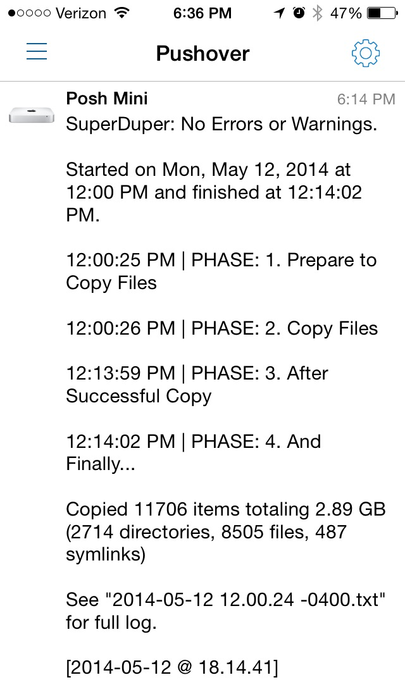

parse-superduper-logs
=====================

**Summary:** Parse SuperDuper Logs and send notifications (requires [posh](https://github.com/tjluoma/po.sh).)

I have [SuperDuper][] set to run automatically on my [MacMiniColo][] which means that I might not notice when it runs, and some other Macs backup overnight. It’s _probably_ safe to assume that everything worked unless I see something went wrong, but when it comes to backups, I’d rather be sure.

So I have [Keyboard Maestro][] configured to run this script whenever SuperDuper quits. You could also use the feature in SuperDuper to run this after the copy completes, but I prefer this method.

The script itself is fairly thoroughly commented, so it should be pretty clear how it works. If not, feel free to get in touch.

This is an example of what a successful copy looks like:

Please note that in order to get push notifications delivered, I am using another script I wrote called [posh](https://github.com/tjluoma/po.sh) which is built using [Pushover](https://pushover.net).

[MacMiniColo]:	http://macminicolo.net/
[SuperDuper]:	http://www.shirt-pocket.com/superduper/
[Keyboard Maestro]:	http://www.keyboardmaestro.com/main/
